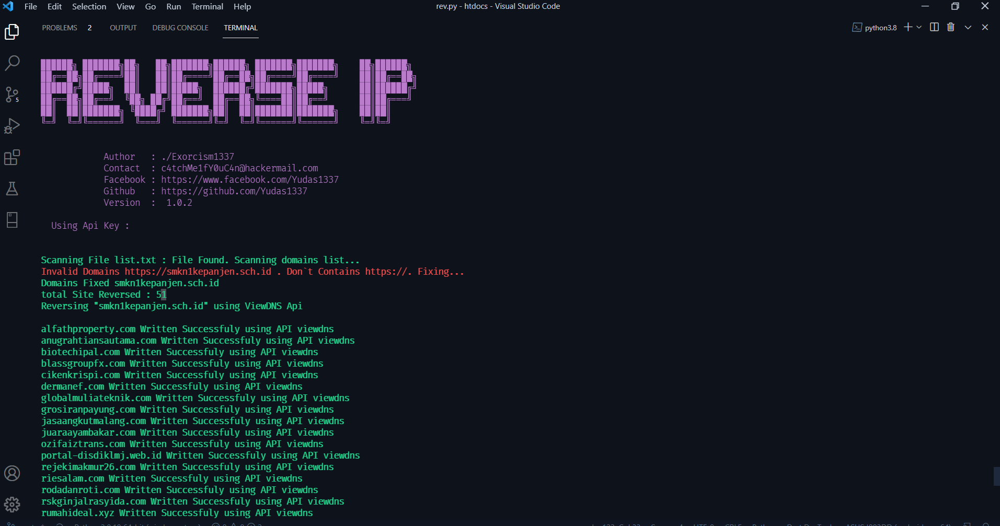

<pre>
<code>
  _____                                _____ _____  
 |  __ \                              |_   _|  __ \ 
 | |__) |_____   _____ _ __ ___  ___    | | | |__) |
 |  _  // _ \ \ / / _ \ '__/ __|/ _ \   | | |  ___/ 
 | | \ \  __/\ V /  __/ |  \__ \  __/  _| |_| |     
 |_|  \_\___| \_/ \___|_|  |___/\___| |_____|_|                                          
</code>
</pre>

# Reverse IP :
Reverse IP is a tools for enumerating DNS Record from a domains / ip address.

# Requirements :
How To use : <code>python3 rev.py -l list.txt</code>

CopyRights | legal Claimers :

<ul>
<li>Author : ./Exorcism1337</li>
</ul>

# Technologies :
<li>Rest API From viewdns.info and hackertarget</li>
<li>Python 3.8.10</li>

# Preview Reverse IP :

